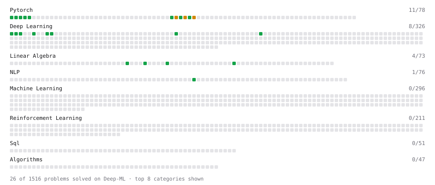

# Deep-ML

My machine learning practice from [Deep-ML](https://www.deep-ml.com). Every solution here was written by hand.

**13** solved · 8 problems · 0 labs · 5 math

[**Browse the interactive portfolio**](https://PranaliDesai.github.io/deep-ml/) to replay this filling in over time.

## Problems

| | Difficulty | Solved | |
| --- | --- | --- | --- |
| [Calculate Cosine Similarity Between Vectors](https://www.deep-ml.com/problems/76) | easy | 2026-10-07 | [solution](problems/0076-calculate-cosine-similarity-between-vectors) |
| [Compute the Cross Product of Two 3D Vectors](https://www.deep-ml.com/problems/118) | easy | 2026-10-07 | [solution](problems/0118-compute-the-cross-product-of-two-3d-vectors) |
| [Implement ReLU Activation Function](https://www.deep-ml.com/problems/42) | easy | 2026-10-07 | [solution](problems/0042-implement-relu-activation-function) |
| [L2 Normalization Along an Axis](https://www.deep-ml.com/problems/1022) | easy | 2026-10-07 | [solution](problems/1022-l2-normalization-along-an-axis) |
| [Leaky ReLU Activation Function](https://www.deep-ml.com/problems/44) | easy | 2026-10-07 | [solution](problems/0044-leaky-relu-activation-function) |
| [Sigmoid Activation Function Understanding](https://www.deep-ml.com/problems/22) | easy | 2026-10-07 | [solution](problems/0022-sigmoid-activation-function-understanding) |
| [Softmax Activation Function Implementation ](https://www.deep-ml.com/problems/23) | easy | 2026-10-07 | [solution](problems/0023-softmax-activation-function-implementation) |
| [Vector Norms (L1/L2/L-inf) and the Frobenius Norm](https://www.deep-ml.com/problems/328) | easy | 2026-10-07 | [solution](problems/0328-vector-norms-l1-l2-l-inf-and-the-frobenius-norm) |

## Math

| | Difficulty | Solved | |
| --- | --- | --- | --- |
| [Derivatives and Gradients](https://www.deep-ml.com/math-problems/1) | easy | 2026-10-07 | [solution](math/0001-derivatives-and-gradients) |
| [Gradient Descent Updates](https://www.deep-ml.com/math-problems/5) | easy | 2026-10-07 | [solution](math/0005-gradient-descent-updates) |
| [Information Theory: Entropy](https://www.deep-ml.com/math-problems/24) | medium | 2026-10-07 | [solution](math/0024-information-theory-entropy) |
| [Log-Likelihood Gradients](https://www.deep-ml.com/math-problems/38) | medium | 2026-10-07 | [solution](math/0038-log-likelihood-gradients) |
| [Softmax and Cross-Entropy](https://www.deep-ml.com/math-problems/32) | medium | 2026-10-07 | [solution](math/0032-softmax-and-cross-entropy) |

---

_This file is regenerated by Deep-ML on every push._
